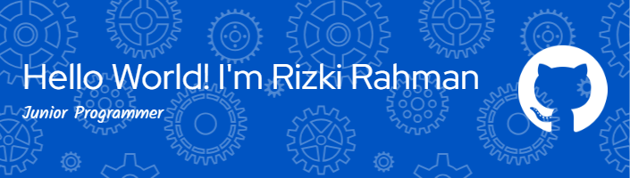

## Hi there! I'm Rizki Rahman Saputra 👋

<!--
**RizkiRahman20/RizkiRahman20** is a ✨ _special_ ✨ repository because its `README.md` (this file) appears on your GitHub profile.

Here are some ideas to get you started:

- 🔭 I’m currently working on ...
- 👯 I’m looking to collaborate on ...
- 🤔 I’m looking for help with ...
- 💬 Ask me about ...
- 😄 Pronouns: ...
- ⚡ Fun fact: ...
-->
🌱 I’m currently learning **JavaScript** and some of **JavaScript** library and framework

##### Skills

  

##### 📫 How to reach me: ...

